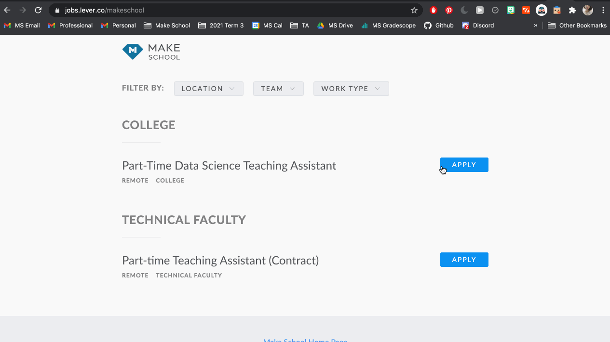

# makescraper - Final project

This project has 2 features:
- You can scrape a link to a job description hosted on Lever and gather basic data, such as company name, title of the position, etc. and adds it to a MongoDB database via command line.
- You can build and host a REST API in your local machine to access the websites you have scraped. 

## Getting Started

These instructions will get you a copy of the project up and running on your local machine for development and testing purposes.

### Prerequisites

Must have Golang installed in your computer.

### Installing

A step by step series of examples that tell you how to get a development env running

Clone the repo

```
git clone https://www.github.com/TasfiaAddrita/make-scraper/
```

Create a .env file and enter following variables with your own MongoDB database.
```
MONGO_URI=[YOUR MONGO URI]
DB_NAME=[NAME OF YOUR DATABASE]
```
Note: Your database should have a collection named `jobs`. 

Build and run program w/o scraping feature 

```
go build && go run main.go api.go
```

or with scraping feature 

```
go build && go run main.go api.go --url [INSERT LEVER JOB LINK HERE]
```

The API will be hosted at `http://localhost:5000/api/jobs`. You can only make `POST` and `GET` requests.

### Demo


## Running the tests

```
go test 
go test -bench=.
```

### Break down into end to end tests

Explain what these tests test and why

`TestGetJobDetailsFromURL` tests if the app scrapes [this website](https://jobs.lever.co/lever/45b30441-05e6-4eae-b004-f2f9895f6942) properly. 

`BenchmarkTestGetJobDetailsFromURL` tests how long it takes to scrape the above website.

## Packages used
- Mux
- MongoDB 
- colly 